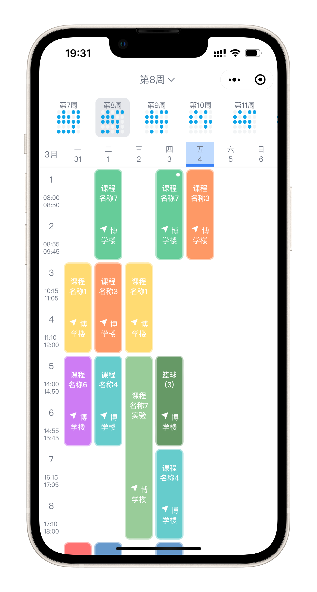
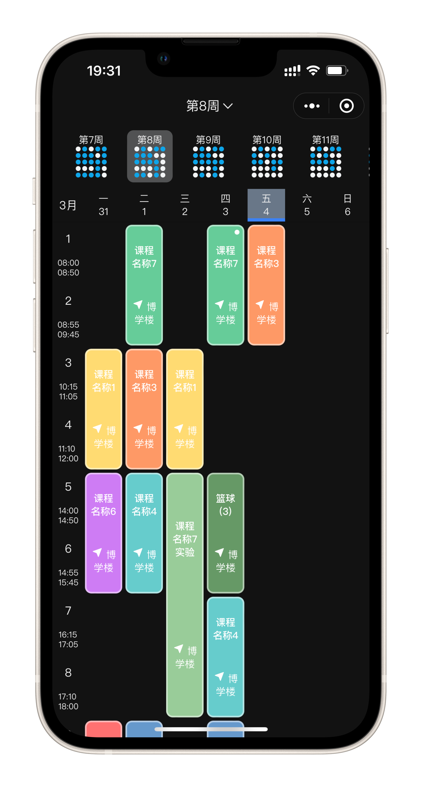

<br>
<h2 align="center">uni-app 课程表组件</h2>
<br>
<p align='center'>
  </img>
  </img>
</p>

<br>

## 特性
- 🗓  可视化周选择、课程删除/置顶、课程详情卡片

- ⚡️ [Vue 3](https://github.com/vuejs/vue-next), [Vite 2](https://github.com/vitejs/vite), [pnpm](https://pnpm.js.org/), [ESBuild](https://github.com/evanw/esbuild) - 就是快！

- 🍍 [使用 Pinia 的状态管理](https://pinia.esm.dev/)

- 🎨 [UnoCSS](https://github.com/unocss/unocss) - 高性能且极具灵活性的即时原子化 CSS 引擎

- 😃 [各种图标集为你所用](https://github.com/antfu/unocss/tree/main/packages/preset-icons)

- 🔥 使用 [新的 `<script setup>` 语法](https://github.com/vuejs/rfcs/pull/227)

- 📥 [API 自动加载](https://github.com/antfu/unplugin-auto-import) - 直接使用 Composition API 无需引入

- 🦾 TypeScript 的类型检查


## 预配置

### UI 框架

- [UnoCSS](https://github.com/antfu/unocss) - 高性能且极具灵活性的即时原子化 CSS 引擎

### Icons

- [Iconify](https://iconify.design) - 使用任意的图标集，浏览：[🔍Icônes](https://icones.netlify.app/)
- [UnoCSS 的纯 CSS 图标方案](https://github.com/antfu/unocss/tree/main/packages/preset-icons)

### 插件

- [`unplugin-auto-import`](https://github.com/antfu/unplugin-auto-import) - 直接使用 Composition API 等，无需导入
- [`vite-plugin-unocss-to-uni`](https://github.com/zguolee/vite-plugin-unocss-to-uni) - UnoCSS 到 UniApp 的转换器

<br>


## Install and use

[uni-app 项目支持 vue 3.0 介绍，及升级指南](https://ask.dcloud.net.cn/article/37834)

- Get the project code

```
git clone https://github.com/zguolee/ColorTimetable.git
```

- Installation dependencies
  
```
cd ColorTimetable

pnpm install
```

- Run

```
pnpm run dev:mp-weixin
```

- Build

```
pnpm run build:mp-weixin
```


## Change Log

### Version 2.1.0
#### Features
* Add a page to add and edit course

#### Changed
* **Change course data structure**
* Change the course card display method

<br>

### Version 2.0.0
#### Features
* Update from Vue2 to Vue3
* Dark theme


### Version 1.x

[ColorTimetable Vue2](https://github.com/zguolee/ColorTimetable/tree/vue2)


## License

[MIT](./LICENSE) License © 2021-PRESENT [Neil](https://github.com/zguolee)
